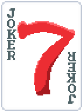
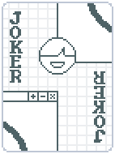
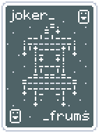
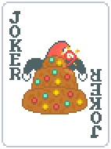
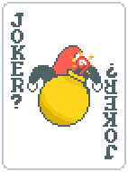

# Polydactyly

- **Rarity**: Uncommon
- **Base Cost**: $6
- Incompatible with **Blueprint**
- **Description**: Choose an extra card from **Booster Packs**

*Art by Etiketi, modified by me. something something binding of isaac*

# Miracle Milk

- **Rarity**: Common
- **Base Cost**: $4
- **Description**: **Undebuff** all scored cards. This Joker gains **+8** Chips per **undebuffed** card

When a debuffed card is scored, it will be undebuffed before calculations occur.

*Painful Death for the Lactose Intolerant, struggle 'till your last moment!*

# Yield My Flesh

- **Rarity**: Uncommon
- **Base Cost**: $7
- **Description**: **X3** Mult after first played hand scores less than **5%** of required chips

Does not trigger XMult on the first hand.

*get distorted L*

# R Key

- **Rarity**: Rare
- **Base Cost**: $15
- Incompatible with **Blueprint**
- Incompatible with **Eternal**
- **Description**: Sell this Joker to reduce Ante by **2**, down to minimum Ante **1**

Has +84 extra cost, bringing the buying cost up to 99.

*Art from The Binding of Isaac: Repentance. Originally a standalone mod that reduces Ante by 10 instead. Quite balanced.*

# Lucky Seven

- **Rarity**: Common
- **Base Cost**: $3
- **Description**: When **Blind** is selected, lose **$3** and use **The Wheel of Fortune** *(if possible)*

Can make you go into debt.\
Does not take money or use **The Wheel of Fortune** if all Jokers have an edition.

*Art by Revenge. Gambling pog.*

# Options

- **Rarity**: Uncommon
- **Base Cost**: $5
- Incompatible with **Blueprint**
- **Description**: After playing a hand, draw **two** extra cards

Can go over hand size limit.\
Discarding will not draw extra cards past the hand size limit.

*Unlimited flexibility*

# Credits

- **Rarity**: Uncommon
- **Base Cost**: $5
- Incompatible with **Blueprint**
- **Description**: After discarding, draw **two** extra cards

Can go over hand size limit.\
Playing a hand will not draw extra cards past the hand size limit.

*Funding for this program was made possible by- by- by- by- by-*

# Autism Creature

- **Rarity**: Common
- **Base Cost**: $4
- **Description**: **+6** Mult for each empty **Joker** slot

Does not count itself as an empty Joker slot. However, it will count **Joker Stencil**.

*Art by C_rry, modified by me. yippeeeee!!!!!!!*

# Suspicious Joker

- **Rarity**: Uncommon
- **Base Cost**: $7
- **Description**: Downgrade played hand to gain **X0.25** Mult

Played hand must be higher than level 1 for effect to activate.

*Art by C_rry, modified by me. when the jester is skeptical!*

# Exploding Fruitcake

- **Rarity**: Rare
- **Base Cost**: $7
- **Description**: When **Small Blind** begins, give a random **Edition** to all Jokers and consumables, then replace this with a **bobm**
- Incompatible with **Eternal**

Consumables with Editions still give their effects.
Edition chances are the same as **The Wheel of Fortune**'s, however, there is also a 0.3% chance for **Negative**.

*the art absolutely sucks*

# bobm

- **Rarity**: Common
- **Base Cost**: -$4
- **Description**: **Negative**, **Eternal**. Lose the game after **300** seconds
- Cannot appear normally

Game speed does not affect the timer.
Spawns normally from **Exploding Fruitcake**.
You *will* lose the game when the timer is up.

*the slowest submitted Balatro with skips on White Stake speedrun on speedrun.com is 4 minutes and 31 seconds. good luck.*

# Collectible Card

- **Rarity**: Rare
- **Base Cost**: $8
- **Description**: Each scored card with same **rank** as the **first** scored card gives **+4** Chips to all cards in **full deck** of that rank